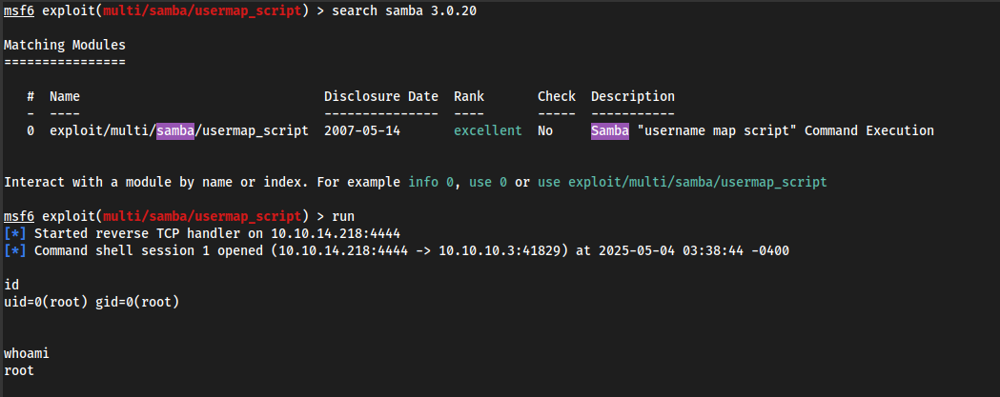

# Lame


## Introduction

**Lame** is an iconic Linux machine, often used as a first target by beginners. It exposes a vulnerable Samba service, allowing remote command execution without authentication. The exploit relies on an old vulnerability `(CVE-2007-2447)` affecting the version of Samba used. This machine allows you to learn the basics of network enumeration, the SMB protocol, and exploiting command injection flaws.

## Enumeration

Nmap scan


## Footprinting

**FTP Enum**


Using MSF the exploit does not work


**SMB Enum**

Anonymous authentication is accepted and we can see the samba version

```sh
┌──(kali㉿dipeua-pc)-[~/HackTheBox/Lame]
└─$ smbclient -L 10.10.10.3 -N
Anonymous login successful

	Sharename       Type      Comment
	---------       ----      -------
	print$          Disk      Printer Drivers
	tmp             Disk      oh noes!
	opt             Disk      
	IPC$            IPC       IPC Service (lame server (Samba 3.0.20-Debian))
	ADMIN$          IPC       IPC Service (lame server (Samba 3.0.20-Debian))
Reconnecting with SMB1 for workgroup listing.
Anonymous login successful

	Server               Comment
	---------            -------

	Workgroup            Master
	---------            -------
	WORKGROUP            LAME
```

The Samba version is `3.0.20`

## Initial Access 

Search for this version in MSF and exploit


