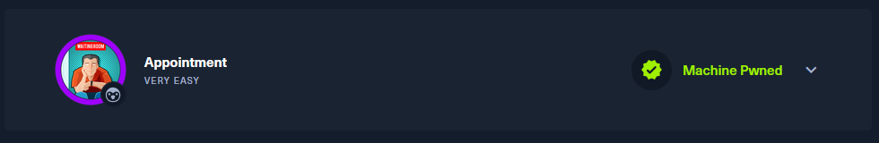
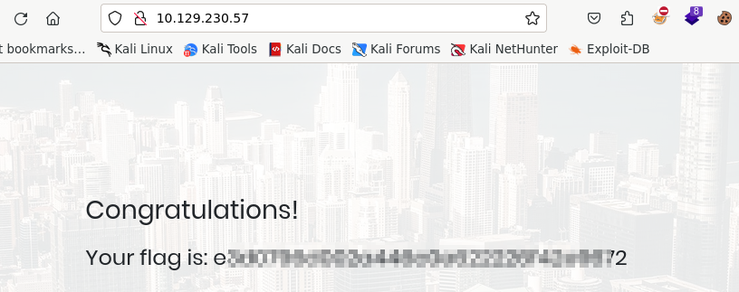

What does the acronym SQL stand for?

```
Structured Query Language
```

What is one of the most common type of SQL vulnerabilities?

```
SQL injection
```


What is the 2021 OWASP Top 10 classification for this vulnerability?

```
A03:2021-Injection
```


What does Nmap report as the service and version that are running on port 80 of the target?

```
Apache httpd 2.4.38 ((Debian))
```

What is the standard port used for the HTTPS protocol?

```
443
```

What is a folder called in web-application terminology?

```
directory
```

What is the HTTP response code is given for 'Not Found' errors?

```
404
```

Gobuster is one tool used to brute force directories on a webserver. What switch do we use with Gobuster to specify we're looking to discover directories, and not subdomains?

```
dir
```


What single character can be used to comment out the rest of a line in MySQL?

```
#
```




If user input is not handled carefully, it could be interpreted as a comment. Use a comment to login as admin without knowing the password. What is the first word on the webpage returned?

```
Congratulations
```