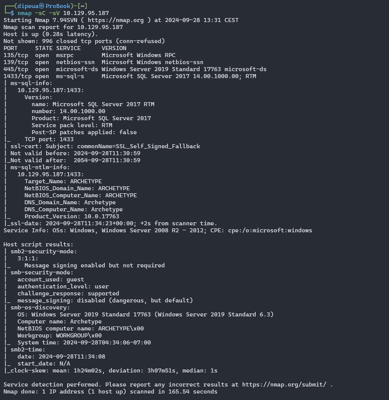
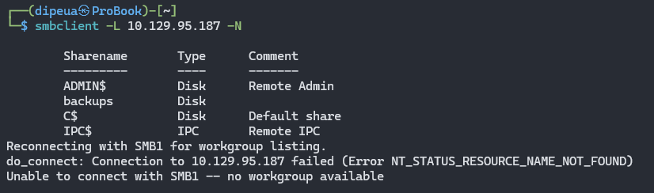
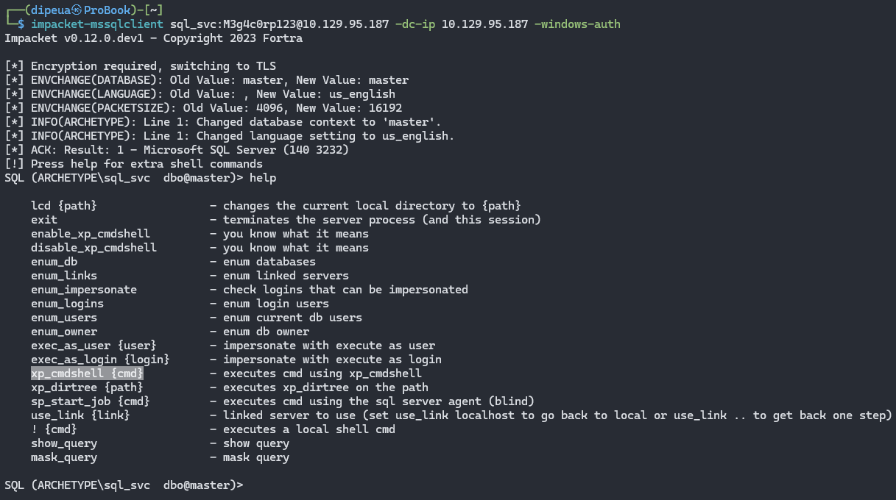
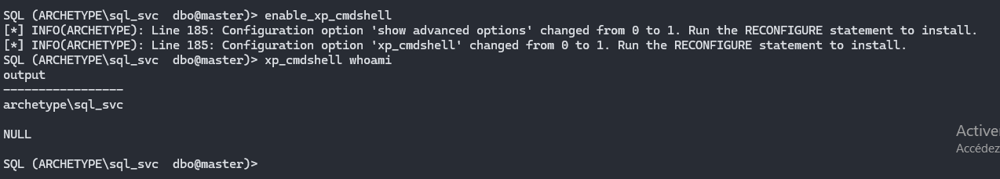

Which TCP port is hosting a database server?

```
1433
```



What is the name of the non-Administrative share available over SMB?

```
backups
```


What is the password identified in the file on the SMB share?

```
M3g4c0rp123
```



What script from Impacket collection can be used in order to establish an authenticated connection to a Microsoft SQL Server?

```
mssqlclient.py
```

What extended stored procedure of Microsoft SQL Server can be used in order to spawn a Windows command shell?

```
xp_cmdshell
```



What script can be used in order to search possible paths to escalate privileges on Windows hosts?

```
winpeas
```

What file contains the administrator's password?

```
?????
```

