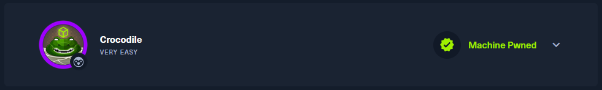
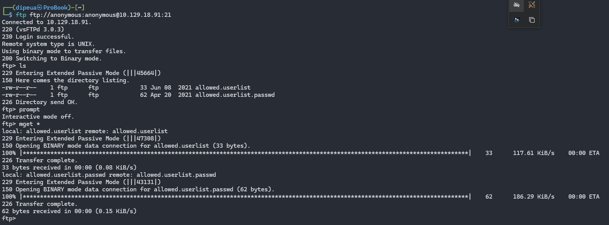
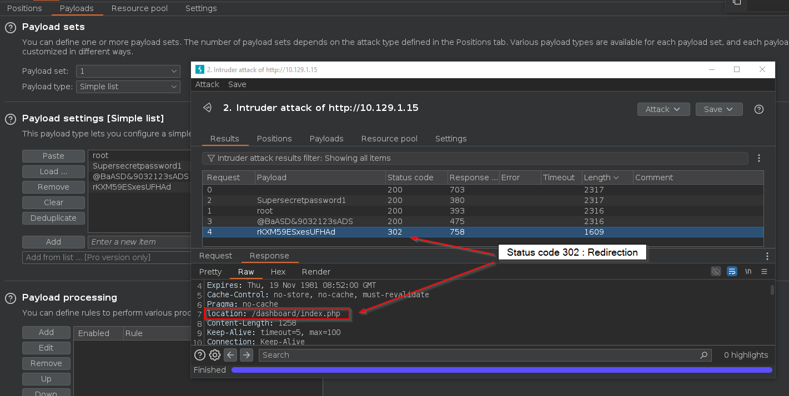

What Nmap scanning switch employs the use of default scripts during a scan?

```
-sC
```

What service version is found to be running on port 21?

```
vsftpd 3.0.3
```

What FTP code is returned to us for the "Anonymous FTP login allowed" message?

```
230
```



After connecting to the FTP server using the ftp client, what username do we provide when prompted to log in anonymously?

```
anonymous
```

After connecting to the FTP server anonymously, what command can we use to download the files we find on the FTP server?

```
get
```

What is one of the higher-privilege sounding usernames in 'allowed.userlist' that we download from the FTP server?

```
admin
```


What version of Apache HTTP Server is running on the target host?

```
Apache httpd 2.4.41
```


What switch can we use with Gobuster to specify we are looking for specific filetypes?

```
-x
```



Which PHP file can we identify with directory brute force that will provide the opportunity to authenticate to the web service?

```
login.php
```


