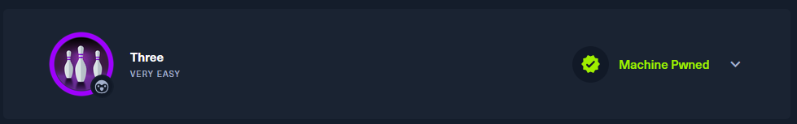
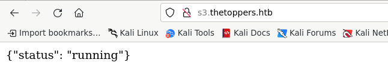
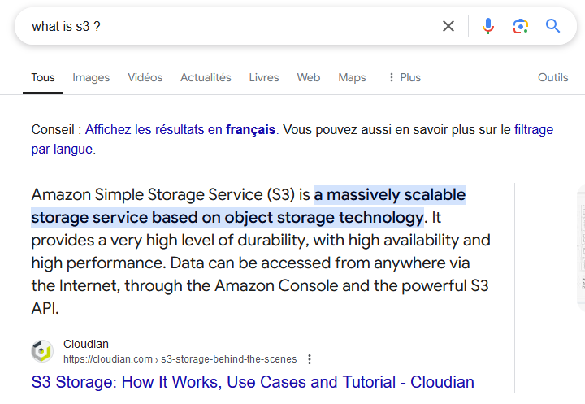
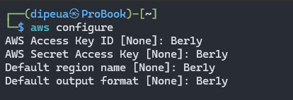
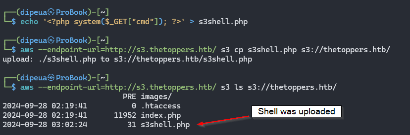

How many TCP ports are open?

```
2
```

What is the domain of the email address provided in the "Contact" section of the website?

```
thetoppers.htb
```

In the absence of a DNS server, which Linux file can we use to resolve hostnames to IP addresses in order to be able to access the websites that point to those hostnames?

```
/etc/hosts
```

Which sub-domain is discovered during further enumeration?

```
s3.thetoppers.htb
```





Which service is running on the discovered sub-domain?

```
Amazon S3
```


Which command line utility can be used to interact with the service running on the discovered sub-domain?

```
awscli
```




Which command is used to set up the AWS CLI installation?

```
aws configure
```


What is the command used by the above utility to list all of the S3 buckets?

```
aws s3 ls
```


This server is configured to run files written in what web scripting language?

```
PHP
```




